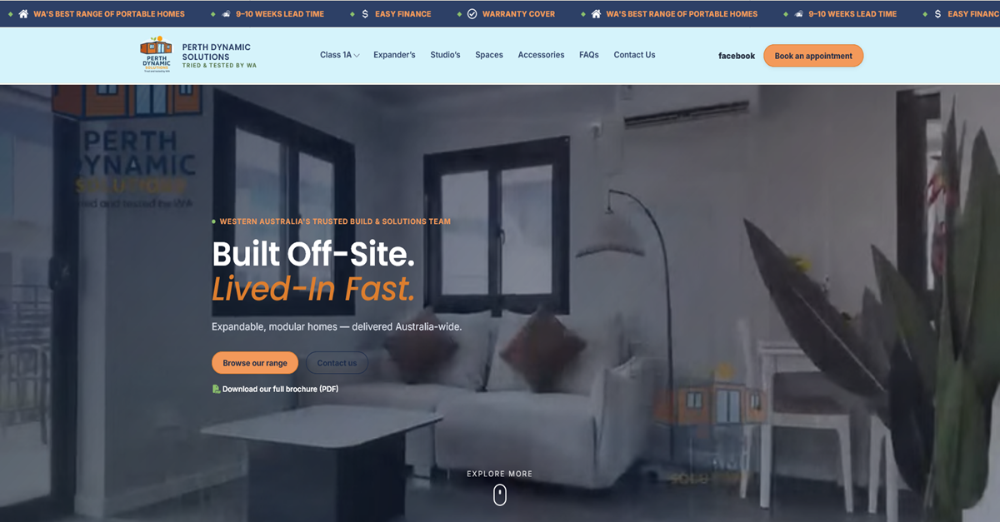
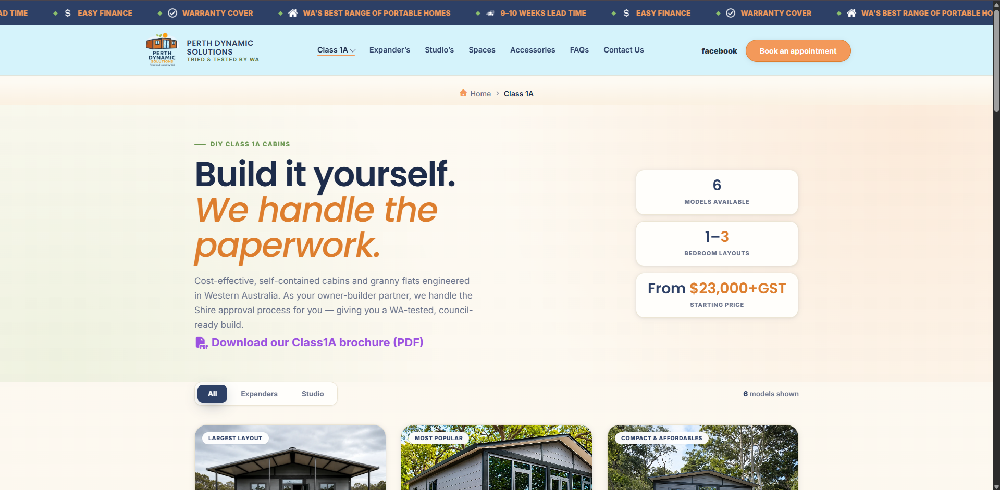
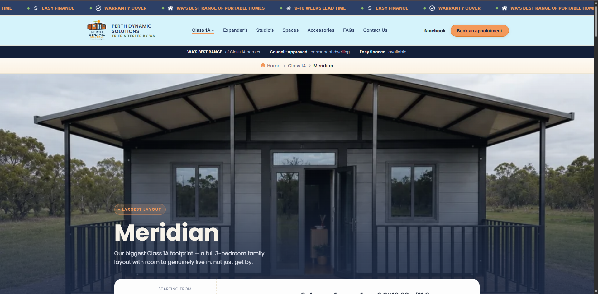

# Perth Dynamic Solutions Child Theme

WordPress child theme for [Perth Dynamic Solutions](https://perthdynamicsolutions.com.au/), a WA portable homes company. Parent theme is Hello Elementor; custom PHP page templates handle the product listings.

## Screenshots

**Homepage**



**Category Listing** *(any product-category page: Expanders, Cabins & Pods, etc. Layout is the same across all of them)*



**Single Product**



## Stack

*Page templates, product CPT/taxonomy logic, and all CSS/JS below are custom-coded. Plugins here only handle their own specific feature.*

- Parent theme: Hello Elementor
- Elementor (page building on top of custom templates)
- ACF (product fields: dimensions, layouts, swatches)
- Fluent Forms Pro: quote form (`page-quote.php`, shortcode id 5) and contact form (`page-contact.php`, shortcode id 6)
- WP Rocket (caching)

## Structure

```
├── functions.php              # CPT/taxonomy registration, asset enqueue, nav walker
├── header.php / footer.php    # global header/footer
├── front-page.php             # homepage (Template Name: Home)
├── page-*.php                 # custom page templates, see "Page templates" section below for full list + status
├── single-products-*.php      # single product templates, routed by product_category term
├── footer.js / footer-reveal.js  # footer scroll/reveal behavior
├── style.css                  # theme header (required by WP) + CSS custom properties
└── assets/
    ├── quote-form-custom.css / .js   # Get a Quote page only, loaded conditionally
    ├── css/                   # one stylesheet per page/template, enqueued conditionally
    ├── img/                   # icons, footer images, hero illustration
    ├── video/                 # hero + step videos (mp4/webm pairs)
    └── docs/                  # downloadable brochures (PDF)
```

## Product system

- **CPT:** `product` (registered in `functions.php`, `has_archive` off, category pages replace the archive)
- **Taxonomy:** `product_category`, terms: `class-1a`, `cabins-pods`, `expanders`, `half-expander`, `spaces`, `accessories`
- **Single template routing:** `pds_product_single_template()` filter maps each product's `product_category` term to the matching `single-products-*.php` file:
  - `class-1a`, `half-expander` → `single-products-class1a.php`
  - `expanders` → `single-products-expander.php`
  - `cabins-pods` → `single-products-studios.php`
  - `spaces` → `single-products-spaces.php`
- **CSS** for each is loaded the same way, via `pds_enqueue_single_product_styles()`.
- **Note:** `accessories` term has no single-product route. A single Accessory product falls back to the parent theme's default template (no `single-products-accessories.php` exists). Add one if individual accessory product pages are ever needed.

## Page templates

| File | Template Name | Purpose | Status |
|---|---|---|---|
| `front-page.php` | Home | Homepage, hero video/illustration | Live |
| `page-studios.php` | Studios | Studios listing | Live |
| `page-expanders.php` | Expander | Expanders listing | Live |
| `page-half-expanders.php` | Half Expanders | Half Expanders listing | Live |
| `page-class-1a.php` | Class 1A Page | DIY Class 1A listing | Live |
| `page-spaces.php` | Spaces | Spaces listing | Live |
| `page-accessories.php` | Accessories Page | Accessories listing | Live |
| `page-quote.php` | Get a Quote | Quote form (Fluent Forms) | Feature added, later removed from live by client. Kept in codebase for future use. |
| `page-finance.php` | Finance Page | Credit One embedded quote form | Live |
| `page-contact.php` | Contact Us | Contact form (Fluent Forms) | Live |
| `faqs.php` | FAQ Page | FAQs | Live |

## Notes

- Page/product CSS is cache-busted with `filemtime()`, not a fixed version string. No manual bump needed on edit.
- Hello Elementor's own default CSS output is disabled (`hello_elementor_enqueue_style` etc. filtered to `false`). This theme supplies all styling itself.
